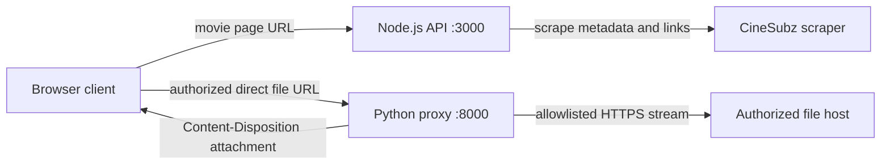

<div align="center">

# CineSubz API

<a href="https://github.com/Manishshah127776/cinesubz-api">
  
</a>

<p>
  <strong>Node.js metadata API + Python streaming proxy</strong><br>
  Search, inspect, and stream authorized subtitle or file resources through a clean API surface.
</p>

<p>
  
  
  
  
</p>

</div>

> **Important:** Use the scraper and proxy only for resources you own or are authorized and licensed to access and redistribute. The proxy is intentionally allowlisted and is not an unrestricted third-party download service.

## What it does

CineSubz API exposes a Node.js API for homepage data, movies, TV shows, search, and link extraction. A separate Python FastAPI service handles CORS-friendly streaming for direct resources on explicitly allowlisted hosts.

The project includes a small standalone browser client in [`client.html`](./client.html) that calls the Node API, displays returned links, and sends authorized direct file URLs through the Python proxy.

## Architecture



## API endpoints

| Method | Endpoint | Purpose |
| --- | --- | --- |
| `GET` | `/` | API landing response |
| `GET` | `/health` | Node API health check |
| `GET` | `/api/docs` | Endpoint description |
| `GET` | `/api/home` | Trending and top lists |
| `GET` | `/api/movies?page=1` | Paginated movie list |
| `GET` | `/api/movies/:id` | Movie details and extracted links |
| `GET` | `/api/tvshows?page=1` | Paginated TV show list |
| `GET` | `/api/tvshows/:id` | TV show details and extracted links |
| `GET` | `/api/search?q=query&page=1` | Search movies and TV shows |
| `GET` | `/api/download?url=PAGE_URL` | Extract links from an authorized page |
| `GET` | `/api/proxy-download?url=FILE_URL` | Stream an authorized file through the CORS proxy |

## Quick start

### 1. Install Node dependencies

```bash
npm install
```

### 2. Start the metadata API

```bash
npm start
```

The Node API starts on `http://localhost:3000` by default. Set `PORT` in `.env` to change the port.

### 3. Install Python proxy dependencies

```bash
python3 -m venv .venv
. .venv/bin/activate
pip install -r requirements.txt
```

### 4. Start the streaming proxy

```bash
DOWNLOAD_ALLOWED_HOSTS="your-licensed-file-host.example" \
ALLOWED_ORIGINS="http://localhost:5500" \
PROXY_PORT=8000 \
python3 proxy_api.py
```

The proxy starts on `http://localhost:8000`.

## Calling the services

Extract links from an authorized page through the Node API:

```bash
curl --get http://localhost:3000/api/download \
  --data-urlencode "url=https://your-authorized-site.example/movie-page"
```

Stream a direct authorized file through the Python proxy:

```bash
curl -L -OJ --get http://localhost:8000/api/proxy-download \
  --data-urlencode "url=https://your-licensed-file-host.example/path/file.zip" \
  --data-urlencode "filename=authorized-download.zip"
```

From browser JavaScript:

```javascript
const proxyUrl = new URL("http://localhost:8000/api/proxy-download");
proxyUrl.searchParams.set("url", directFileUrl);
proxyUrl.searchParams.set("filename", "authorized-download.bin");
window.location.href = proxyUrl.toString();
```

## Proxy safeguards

The Python proxy includes explicit host allowlisting, HTTP and HTTPS scheme validation, standard-port validation, rejection of userinfo-bearing URLs, DNS resolution checks for private or reserved addresses, redirect revalidation, response size limits, sanitized filenames, `Content-Disposition: attachment`, `X-Content-Type-Options: nosniff`, and `Cache-Control: no-store`.

For production, set `DOWNLOAD_ALLOWED_HOSTS` to exact domains you are authorized to proxy and replace the development-wide CORS setting with your real frontend origin in `ALLOWED_ORIGINS`. Never deploy an unrestricted `?url=` proxy.

## Project layout

```text
.
├── client.html          # Standalone browser client
├── proxy_api.py         # FastAPI CORS-enabled streaming proxy
├── requirements.txt     # Python dependencies
├── scraper.js           # Puppeteer + Cheerio scraper
├── server.js            # Express API server
├── src/routes/          # API route modules
├── package.json         # Node metadata and scripts
└── README.md            # This document
```

## Development notes

The scraper uses Puppeteer with sandbox-disabled launch flags for Linux container compatibility. Keep the dependency versions maintained, review `npm audit` output before deployment, and avoid exposing internal debugging details in public responses.

## License

No license has been specified yet. Add an appropriate license before redistributing the project or its data sources.
